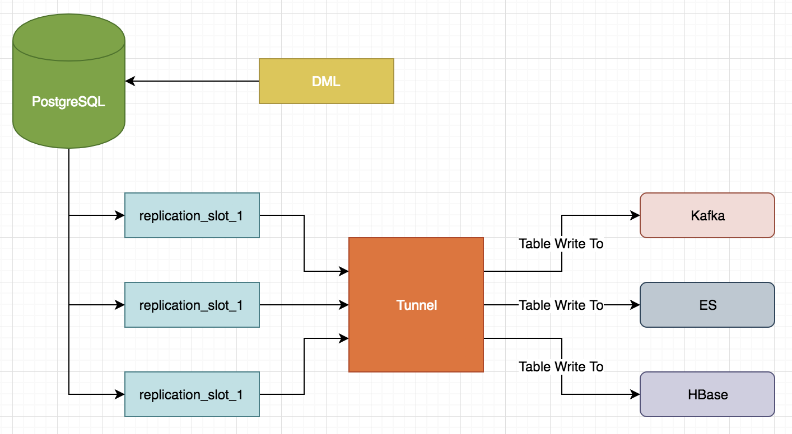

PG数据同步工具（Java实现）
[](https://circleci.com/gh/hellobike/tunnel)

Tunnel 是一个将postgresql的实时数据同步到es或kafka的服务

## 版本支持

- Postgresql 9.4 or later
- Kafka 0.8 or later
- ElasticSearch 5.x

## 架构图



## 原理

tunnel 利用pg内部的逻辑复制功能,通过在pg创建逻辑复制槽,接收数据库的逻辑变更,通过解析test_decoding特定格式的消息,得到逻辑数据

## 安装使用

### 打包

```shell
$ git clone https://github.com/hellobike/tunnel
$ cd tunnel
$ mvn clean package -Dmaven.test.skip=true
```

### 使用

```shell
$ cd target
$ unzip AppTunnelService.zip
$ cd AppTunnelService
$ java -server -classpath conf/*:lib/* com.hellobike.base.tunnel.TunnelLauncher -u false -c cfg.properties
```

## PG 配置

PG数据库需要预先开启逻辑复制[pg配置](./doc/pg.md)

## Tunnel 配置

### 配置文件

[tunnel配置](./doc/cfg.properties)

### 监控

Tunnel支持使用prometheus来监控同步数据状态,[配置Grafana监控](./doc/prometheus.md)

### 同步到 elasticsearch

[同步到elasticsearch](./doc/es.md)

### 同步到 kafka

[同步到kafka](./doc/kafka.md)


## 许可

Tunnel 使用 Apache License 2 许可